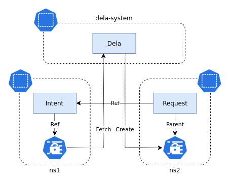

# Dela
[](https://github.com/phillebaba/dela)
[](https://travis-ci.org/phillebaba/dela)
[](https://goreportcard.com/report/github.com/phillebaba/dela)
[](https://hub.docker.com/r/phillebaba/dela)
Kubernetes controller to share Secrets between namespaces.

## Background
Within Kubernetes, a Pod can only read a Secret that exists within the same Namespce as itself. There are probably many reasons for this, one being security concerns. This limitations can create pain points, as teams may want to share Secrets between each other, but they only have access to their own Namespaces. Dela is a proposed solution to the problem, by allowing specific Secrets to be shared from a source Namespace to be shared with a destination Namespace.



Dela works by creating a ShareIntent in the source Namespace and a ShareRequest in the destination Namespace. The ShareIntent defines which Secret should be shared. The ShareRequest defines which ShareIntent to copy the secret from. The architecture allows a security model where a Secret can only be shared if explicitly indicated to be shared.

## Install
Easiest way is to add a git reference in your `kustomization.yaml` file.
```yaml
apiVersion: kustomize.config.k8s.io/v1beta1
kind: Kustomization
resources:
- github.com/phillebaba/dela//config/default
```

Or you can add the CRD and Deploy the controller in your cluster manually.
```bash
kustomize build config/default | kubectl apply -f -
```

## How to use
First create a Secret and a ShareIntent that references the Secret in one Namespace. Note the `allowedNamespaces` field that indicates which Namespaces are allowed to create a request for the intent.
```yaml
apiVersion: share.phillebaba.io/v1alpha1
kind: ShareIntent
metadata:
  name: main
  namespace: ns1
spec:
  secretRef: main
  allowedNamespaces:
  - ns2
---
apiVersion: v1
kind: Secret
metadata:
  name: main
  namespace: ns1
stringData:
  foo: bar
```

Then create a ShareRequest that references the ShareIntent in another Namespace.
```yaml
apiVersion: share.phillebaba.io/v1alpha1
kind: ShareRequest
metadata:
  name: main
  namespace: ns2
spec:
  intentRef:
    name: main
    namespace: ns1
```

This should now result in an identical Secret in the Second Namespace.
```yaml
apiVersion: v1
kind: Secret
metadata:
  name: main
  namespace: ns1
stringData:
  foo: bar
```

## License
This project is licensed under the MIT License - see the [LICENSE](LICENSE) file for details.
